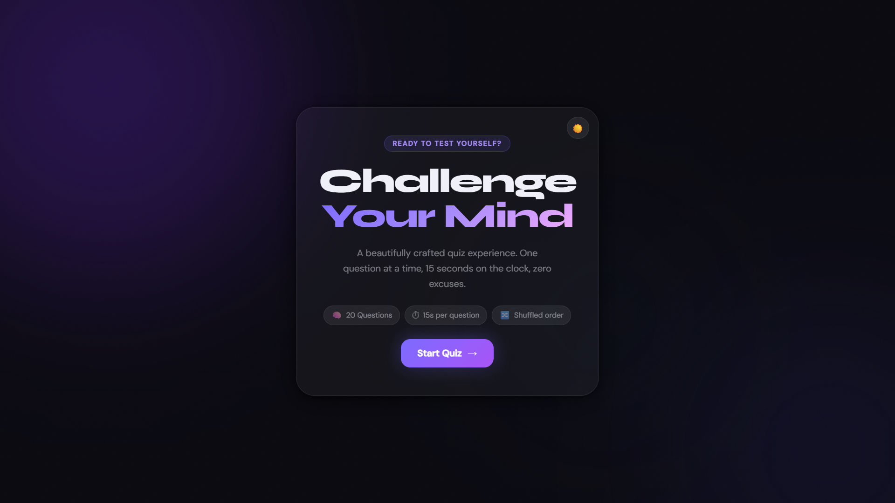
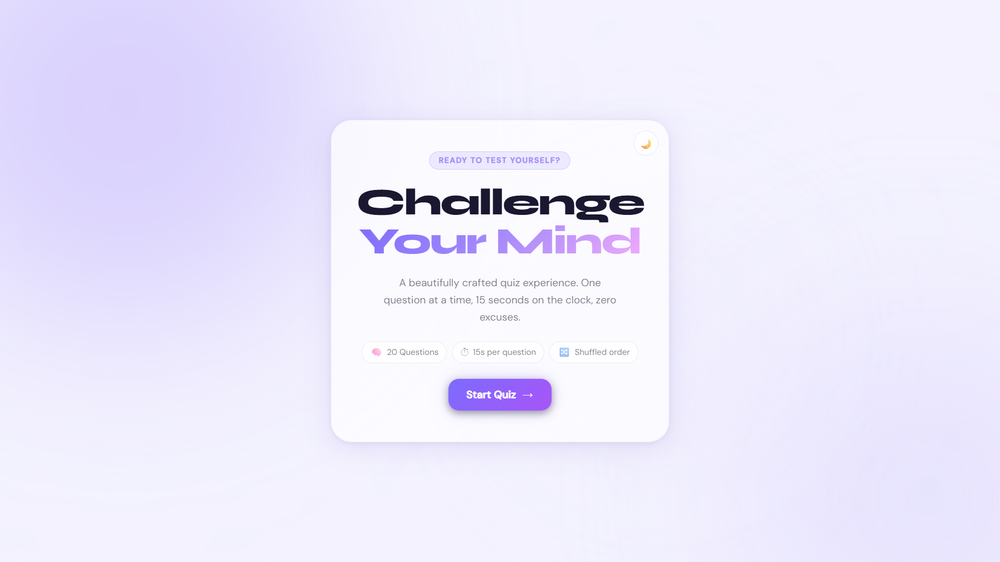
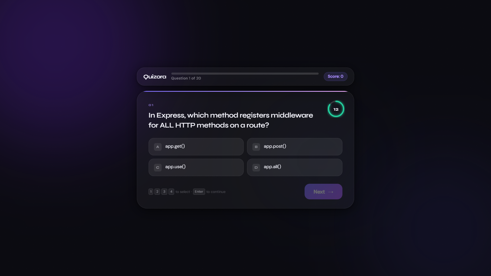
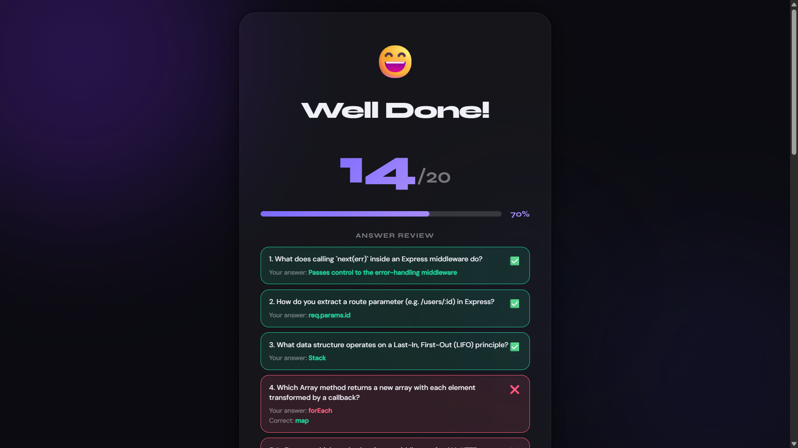

<div align="center">

# ⚡ Quizora

### A premium, full-stack quiz experience — zero dependencies on the frontend, production-grade Node.js on the backend.

[](https://nodejs.org)
[](https://expressjs.com)
[](https://developer.mozilla.org/en-US/docs/Web/JavaScript)
[](LICENSE)

</div>

---

## 🤖 Vibe Coding Index

> This project was built using **AI-assisted development** — a workflow where AI tools handle the heavy lifting of code generation while the developer guides architecture, design decisions, and orchestration.

| Tool                              | Role                  | Used For                                                                                         |
| --------------------------------- | --------------------- | ------------------------------------------------------------------------------------------------ |
| **Claude Sonnet 4.6** (Anthropic) | Code Generation       | Writing all frontend HTML/CSS/JS, backend Express routes, controllers, middleware, and utilities |
| **ChatGPT** (OpenAI)              | Project Orchestration | High-level planning, architecture decisions, feature scoping, prompt engineering for Claude      |

**How it worked:**

1. ChatGPT was used to define the project architecture — deciding on the tech stack, folder structure, API contract, and feature set.
2. Claude Sonnet 4.6 (via Claude Code) was then prompted with precise specifications to generate each file: the Express app, controllers, middleware, the full frontend SPA, and this README.
3. The developer reviewed, tested, and glued everything together — validating API responses, fixing edge cases, and ensuring design consistency.

> The result: a polished, production-quality quiz app built in a fraction of the time traditional development would take.

---

## 📸 Screenshots

### Start Screen — Dark Mode


_The welcome card with glassmorphism styling, animated background orbs, and a prominent "Start Quiz" CTA._

### Start Screen — Light Mode


_Full light theme support via CSS custom properties — toggled with the sun/moon button in the top-right corner._

### Quiz Screen — Active Question


_Per-question SVG countdown ring (15s), progress bar, real-time score badge, and keyboard shortcut hints._

### Results Screen — Answer Review


_Score summary with animated percentage bar, per-question breakdown showing correct and incorrect answers with the right answer revealed._

---

## 📋 Table of Contents

- [Overview](#overview)
- [Tech Stack](#tech-stack)
- [Project Structure](#project-structure)
- [Getting Started](#getting-started)
- [Frontend Features](#frontend-features)
- [Backend API Reference](#backend-api-reference)
- [App Flow](#app-flow)
- [Architecture](#architecture)
- [Theming System](#theming-system)
- [Keyboard Shortcuts](#keyboard-shortcuts)
- [Grading Scale](#grading-scale)
- [Running Tests](#running-tests)
- [Adding Questions](#adding-questions)
- [Scaling to Production](#scaling-to-production)
- [Browser Support](#browser-support)

---

## Overview

Quizora is a full-stack quiz application with a **zero-dependency vanilla JS frontend** and a **Node.js + Express backend**. The frontend fetches a question bank from the API, guides the user through a timed multi-choice quiz with live countdown timers, submits answers, and renders a detailed results screen — complete with fluid animations, glassmorphism UI, ambient audio cues, and a confetti celebration on passing.

No build step. No frontend framework. No bundler. Just open `index.html` and go.

---

## Tech Stack

### Backend

| Layer      | Choice                            | Why                                        |
| ---------- | --------------------------------- | ------------------------------------------ |
| Runtime    | Node.js 18+                       | LTS, native fetch, ESM support             |
| Framework  | Express 4                         | Battle-tested, minimal overhead            |
| Validation | Zod                               | Type-safe schema parsing with great errors |
| Security   | Helmet + rate-limiter             | Industry-standard hardening                |
| Logging    | Morgan (prod) + custom dev logger | Environment-appropriate output             |
| Sessions   | In-memory Map                     | Zero-dep, swap for Redis in prod           |

### Frontend

| Category   | Details                                                 |
| ---------- | ------------------------------------------------------- |
| Language   | Vanilla HTML + CSS + JavaScript (ES6+)                  |
| Styling    | CSS custom properties, glassmorphism, `backdrop-filter` |
| Fonts      | Google Fonts — Syne (display), DM Sans (body)           |
| Audio      | Web Audio API — synthesised tones, no audio files       |
| Animations | CSS keyframes + `requestAnimationFrame` for confetti    |
| Build step | None                                                    |

---

## Project Structure

```
quizora/
├── frontend/
│   ├── index.html          # Single-page markup — all screens declared here
│   ├── style.css           # Design tokens, animations, component styles
│   └── script.js           # All app logic (state, fetch, timer, audio, confetti)
│
└── backend/
    ├── src/
    │   ├── config/
    │   │   └── env.js              # Env var loader + typed config object
    │   ├── controllers/
    │   │   └── quizController.js   # All business logic (grading, scoring)
    │   ├── data/
    │   │   ├── questions.js        # Question bank + data access layer
    │   │   └── sessionStore.js     # In-memory session management
    │   ├── middleware/
    │   │   └── index.js            # CORS, rate limiting, error handling
    │   ├── routes/
    │   │   ├── quizRoutes.js       # Quiz endpoints
    │   │   └── healthRoutes.js     # Health check
    │   ├── utils/
    │   │   └── testRunner.js       # Zero-dep integration tests
    │   ├── app.js                  # Express app factory (no listen)
    │   └── server.js               # HTTP server + graceful shutdown
    ├── .env                        # Local secrets (gitignored)
    ├── .env.example                # Documented env template
    └── package.json
```

---

## Getting Started

### Prerequisites

- Node.js 18+
- npm
- A modern browser (Chrome 90+, Firefox 88+, Safari 14+, Edge 90+)

### 1. Start the Backend

```bash
cd backend

# Install dependencies
npm install

# Configure environment
cp .env.example .env
# Edit .env as needed

# Start in development (auto-reload)
npm run dev

# Start in production
NODE_ENV=production npm start
```

Server boots on **http://localhost:5000** by default.

### 2. Start the Frontend

```bash
cd frontend

# Option A — serve with any static file server
npx serve .

# Option B — Python
python3 -m http.server 3000

# Option C — open index.html directly in your browser
```

### 3. Configure the API URL

All runtime configuration lives at the top of `script.js`:

```js
const API_BASE = "http://localhost:5000"; // Backend origin
const TIMER_SEC = 15; // Seconds per question
```

---

## Frontend Features

| Category               | Details                                                                             |
| ---------------------- | ----------------------------------------------------------------------------------- |
| **UI / UX**            | Glassmorphism cards, animated background orbs, noise texture overlay                |
| **Theming**            | Dark (default) & Light modes via `data-theme` attribute                             |
| **Timer**              | Per-question SVG ring countdown (15s); colour shifts green → amber → red            |
| **Audio**              | Web Audio API tones for selection, correct, wrong, and tick — no audio files        |
| **Confetti**           | Canvas-based particle burst on pass (≥ 60%)                                         |
| **Keyboard nav**       | `1`–`4` to select, `Enter`/`Space` to advance                                       |
| **Score badge**        | Animates with a "bump" keyframe on every point gain                                 |
| **Review panel**       | Full per-question breakdown with staggered entrance animation                       |
| **Offline resilience** | Score computed client-side if the submit endpoint is unreachable                    |
| **Accessibility**      | `role="radiogroup"`, `aria-checked`, `aria-label`, `.sr-only`, focus-visible styles |
| **Responsive**         | Single-column layout on ≤ 540px; keyboard hint hidden on mobile                     |

---

## Backend API Reference

### `GET /questions`

Returns shuffled questions (answers stripped) and creates a server-side session.

**Query parameters:**

| Param        | Type                         | Description                            |
| ------------ | ---------------------------- | -------------------------------------- |
| `category`   | string                       | Filter by category (e.g. `JavaScript`) |
| `difficulty` | `easy` \| `medium` \| `hard` | Filter by difficulty                   |
| `limit`      | number (1–50)                | Cap number of questions returned       |

**Response `200`:**

```json
{
  "success": true,
  "sessionId": "550e8400-e29b-41d4-a716-446655440000",
  "count": 20,
  "questions": [
    {
      "id": "js-001",
      "question": "Which keyword declares a block-scoped variable?",
      "options": ["var", "let", "def", "dim"],
      "category": "JavaScript",
      "difficulty": "easy"
    }
  ]
}
```

---

### `POST /submit`

Grades submitted answers and returns a full result breakdown.

**Request body:**

```json
{
  "sessionId": "550e8400-...",
  "answers": {
    "js-001": "let",
    "js-002": "object",
    "js-003": null
  }
}
```

`null` means the question was skipped or timed out.

**Response `200`:**

```json
{
  "success": true,
  "score": 4,
  "total": 5,
  "percentage": 80,
  "grade": "A",
  "breakdown": { "correct": 4, "wrong": 0, "skipped": 1 },
  "results": [
    {
      "questionId": "js-001",
      "question": "Which keyword declares a block-scoped variable?",
      "chosen": "let",
      "correct": "let",
      "explanation": "`let` and `const` are block-scoped, introduced in ES6.",
      "isCorrect": true
    }
  ]
}
```

**Error `409`** — Session already submitted or expired
**Error `400`** — Validation failure

---

### `GET /categories`

```json
{
  "success": true,
  "categories": ["JavaScript", "Node.js", "Express", "HTTP", "Computer Science"]
}
```

### `GET /stats`

```json
{
  "success": true,
  "stats": {
    "total": 20,
    "byCategory": {
      "JavaScript": 5,
      "Node.js": 4,
      "Express": 5,
      "HTTP": 3,
      "Computer Science": 3
    },
    "byDifficulty": { "easy": 10, "medium": 10 }
  }
}
```

### `GET /health`

Liveness probe for load balancers.

```json
{
  "status": "ok",
  "service": "quizora-api",
  "timestamp": "2024-01-15T12:00:00.000Z",
  "uptime": 3600,
  "sessions": 12,
  "memory": { "heapUsedMB": 28 }
}
```

---

## App Flow

```
[loading] ──fetch ok──► [start] ──btn-start──► [quiz] ──all answered──► [submitting] ──► [results]
    │                                                                                          │
    └──fetch fail──► [error] ◄────────────────────────── btn-restart ◄────────────────────────┘
```

| Screen       | Trigger                | Purpose                                                    |
| ------------ | ---------------------- | ---------------------------------------------------------- |
| `loading`    | App boot               | Fetches questions; enforces 600ms minimum display          |
| `start`      | Fetch success          | Welcome card with question count, timer info, start button |
| `quiz`       | "Start Quiz" clicked   | One question at a time with timer, options, progress bar   |
| `submitting` | Last question answered | POST answers to API; 800ms minimum loader                  |
| `results`    | Submit complete        | Score, percentage bar, confetti, answer review             |
| `error`      | Fetch failure          | Error message with retry button                            |

---

## Architecture

### State Management (Frontend)

All mutable state lives in module-level variables — no framework, no store:

```js
let questions = []; // Shuffled question array from API
let current = 0; // Index of the active question
let answers = {}; // { questionId: selectedOptionText }
let score = 0; // Running correct-answer count
let timerID = null; // setInterval handle
let timeLeft = TIMER_SEC;
let selected = null; // Currently selected option value
let quizRunning = false; // Guards against input after timer fires
```

### Timer Engine

The SVG ring countdown recalculates `stroke-dashoffset` every second. It toggles `.warn` (≤ 10s) and `.danger` (≤ 5s) classes on the ring and number label, and plays a tick tone for the final 5 seconds. At `timeLeft === 0`, `autoAdvance()` records a `null` answer and moves forward.

### Audio System

All sounds are synthesised via the **Web Audio API** — no audio files required:

| Function        | Trigger        | Waveform      | Frequency    |
| --------------- | -------------- | ------------- | ------------ |
| `playSelect()`  | Option clicked | sine          | 660 Hz       |
| `playSuccess()` | Score ≥ 60%    | sine arpeggio | C5–G5–C6     |
| `playFail()`    | Score < 60%    | sawtooth      | 280 → 220 Hz |
| `playTick()`    | ≤ 5s remaining | square        | 880 Hz       |

### Offline Scoring Fallback

If the backend is unreachable, the client computes the score locally:

```js
function computeScore() {
  return questions.reduce((s, q, i) => {
    const key = q.id || q._id || i;
    const correct = q.answer || q.correctAnswer || q.correct;
    return answers[key] === correct ? s + 1 : s;
  }, 0);
}
```

---

## Theming System

Quizora uses CSS custom properties scoped to `[data-theme]` on `<html>`. The `:root` block defines dark defaults; `[data-theme="light"]` overrides the subset that differs. Nothing is hardcoded.

| Token            | Dark                     | Light Override           |
| ---------------- | ------------------------ | ------------------------ |
| `--clr-bg`       | `#09090f`                | `#f4f3ff`                |
| `--clr-surface`  | `rgba(255,255,255,0.04)` | `rgba(255,255,255,0.72)` |
| `--clr-accent`   | `#7c6bff`                | —                        |
| `--clr-success`  | `#22d3a0`                | —                        |
| `--clr-danger`   | `#ff5f7e`                | —                        |
| `--clr-warn`     | `#f59e0b`                | —                        |
| `--font-display` | `"Syne", sans-serif`     | —                        |
| `--font-body`    | `"DM Sans", sans-serif`  | —                        |

Toggle via JavaScript:

```js
document.documentElement.setAttribute("data-theme", "light");
```

---

## Keyboard Shortcuts

| Key                | Action                                                |
| ------------------ | ----------------------------------------------------- |
| `1` `2` `3` `4`    | Select answer A / B / C / D                           |
| `Enter` or `Space` | Advance to next question (when an answer is selected) |

---

## Grading Scale

| Percentage | Grade |
| ---------- | ----- |
| 100%       | S     |
| 80–99%     | A     |
| 60–79%     | B     |
| 40–59%     | C     |
| < 40%      | F     |

---

## Running Tests

Start the backend server first, then in a separate terminal:

```bash
cd backend
npm test
```

The test runner uses Node's built-in `http` module — no external test framework needed.

---

## Adding Questions

Edit `src/data/questions.js`. Each question must match this shape:

```js
{
  id:          'unique-kebab-id',      // stable, used as answer map key
  question:    'Question text?',
  options:     ['A', 'B', 'C', 'D'],  // exactly 4
  answer:      'B',                   // must match one of options[]
  category:    'My Category',
  difficulty:  'easy',                // easy | medium | hard
  explanation: 'Shown after submit',  // optional
}
```

---

## Scaling to Production

| What              | How                                                              |
| ----------------- | ---------------------------------------------------------------- |
| Persist sessions  | Swap `sessionStore.js` for an `ioredis` adapter                  |
| Persist questions | Swap `questions.js` for a MongoDB / PostgreSQL adapter           |
| Auth              | Add JWT middleware before quiz routes                            |
| Horizontal scale  | Sessions in Redis → stateless Node instances                     |
| Containerise      | `node:20-alpine`, `EXPOSE 5000`, `CMD ["node", "src/server.js"]` |

---

## Browser Support

| Browser                | Version | Notes                                   |
| ---------------------- | ------- | --------------------------------------- |
| Chrome / Edge          | 90+     | Full support                            |
| Firefox                | 88+     | Full support                            |
| Safari                 | 14+     | `-webkit-backdrop-filter` applied       |
| Mobile Chrome / Safari | Current | Tested; keyboard hint hidden by default |

---

## Accessibility

- Answer options use `role="radiogroup"` on the container and `role="radio"` + `aria-checked` on each button.
- Theme toggle has `aria-label="Toggle dark/light theme"`.
- Decorative elements are marked `aria-hidden="true"`.
- All interactive elements have `:focus-visible` outlines using `--clr-accent`.
- Screen-reader-only content uses the `.sr-only` utility class.

---

## Known Limitations

- No persistent state — refreshing during a quiz resets progress.
- No category/difficulty filter on the frontend (all questions presented in a single shuffled pool).
- Confetti is purely decorative and correctly marked `aria-hidden`.
- Audio silently no-ops in environments that block `AudioContext` creation.

---

## Contributing

1. Fork the repository and create a feature branch: `git checkout -b feat/your-feature`
2. Keep the zero-dependency, no-build-step frontend philosophy in mind.
3. Test across Chrome, Firefox, and Safari — both themes, mobile viewport.
4. Open a pull request with a clear description of what changed and why.

Code style: 2-space indentation, `"use strict"`, meaningful variable names.

---

<div align="center">

Built with ⚡ using Claude Sonnet 4.6 + ChatGPT · Vanilla JS · Pure CSS · Zero frontend dependencies

</div>
